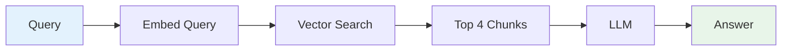
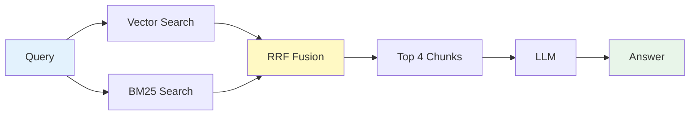
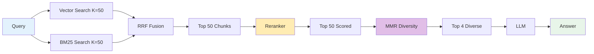

# 🚀 Advanced RAG Pipeline

A modular, production-ready Retrieval-Augmented Generation (RAG) system designed for nuclear regulatory documents (NQA-1, ASME, IAEA standards). Features multiple retrieval strategies, cross-encoder reranking, and agentic reasoning.

---

## 📋 Table of Contents

- [Quick Start](#-quick-start)
- [User Guide](#-users-guide)
- [Query Workflows](#-query-workflows)
- [Configuration Guide](#-configuration-guide)
- [Architecture](#-architecture)
- [Troubleshooting](#-troubleshooting)
- [Advanced Features](#-advanced-features)

---

## 🚀 Quick Start

> **Prerequisites**: Python 3.10+, Ollama installed and running

### 1. Initial Setup (One-time)

\`\`\`bash
# Activate your virtual environment
cd ~/my-first-rag/rag-advanced
source .venv/bin/activate  # or: .venv\Scripts\activate on Windows

# Verify Ollama is running
curl http://localhost:11434/api/tags
\`\`\`

### 2. Add Your Documents

\`\`\`bash
# Place your PDF documents in the data/ folder
cp /path/to/your/*.pdf data/
\`\`\`

### 3. Ingest Documents

**Option A: All-in-one (Recommended)**
\`\`\`bash
# Create vector store + BM25 index in one command
python -m scripts.ingest --strategy section --build-bm25
\`\`\`

**Option B: Step-by-step**
\`\`\`bash
# Step 1: Create vector store with section-aware chunking
python -m scripts.ingest --strategy section

# Step 2: Build BM25 index for hybrid search
# ⚠️ IMPORTANT: Must specify same strategy to avoid duplicate chunks
python -m scripts.ingest --build-bm25 --strategy section
\`\`\`

> **💡 Why section strategy?** For regulatory documents (NQA-1, ASME), section-aware chunking respects document structure (Section, Article, Clause, Annex) for more coherent retrieval.

> **⚠️ Known Issue**: If you run `--build-bm25` without specifying `--strategy`, it will default to `recursive` and re-chunk documents differently, creating duplicates. Always specify the strategy explicitly or use Option A.

### 4. Start Querying

\`\`\`bash
# Basic mode (vector search only)
python -m scripts.query

# Or try hybrid mode (vector + keyword search)
python -m scripts.query --mode hybrid
\`\`\`

---

## 📖 User Guide

### Understanding the Pipeline

Query flows through retrieval → (optional reranking) → LLM generation

**Basic Flow:**
```
PDF → Embed → ChromaDB → Vector Search → Top-K → LLM → Answer
```

**With Reranking:**
```
PDF → Embed → ChromaDB → Vector Search → Top-8 → Reranker → Top-4 → LLM → Answer
```

### Example Queries

**Good for this system:**
✅ "What are QA Level 1 requirements?"
✅ "Explain Section 18.1 of NQA-1"
✅ "What does 10 CFR 50 Appendix B require?"
✅ "Compare ASME and NQA-1 inspection requirements"

**Not ideal:**
❌ "What is quality assurance?" (too broad, not in documents)
❌ "Who wrote NQA-1?" (metadata not in content)

---

## 🔄 Query Workflows

### Mode 1: Basic (Vector Search)

**Best for:** Conceptual questions, general understanding

```
You: What are quality assurance principles?
  ↓
[Vector Search] → Finds semantically similar chunks
  ↓
[LLM] → Generates answer from retrieved context
```

**Command:**
```bash
python -m scripts.query
```

**Pipeline:**


---

### Mode 2: Hybrid (Vector + BM25)

**Best for:** Specific sections, technical terms, exact phrases

```
You: What does NQA-1 Section 18 require?
  ↓
[Vector Search] → Semantic similarity
[BM25 Search] → Exact keyword matching  
  ↓
[RRF Fusion] → Combines both results
  ↓
[LLM] → Generates answer
```

**Command:**
```bash
python -m scripts.query --mode hybrid
```

**Pipeline:**


**Requirements:**
```bash
# Must build BM25 index first
python -m scripts.ingest --build-bm25
```

---

### Mode 3: Hybrid + Reranking + MMR (Recommended)

**Best for:** Maximum precision, technical documents, cross-jurisdictional comparison

```
You: Explain QA Level 1 requirements
  ↓
[Vector + BM25] → Fetch top 50 candidates
  ↓
[Cross-Encoder Reranker] → Scores each query-doc pair
  ↓
[MMR Diversity Selection] → Selects 4 relevant AND diverse chunks
  ↓
[LLM] → High-quality answer with diverse perspectives
```

**Enable reranking + MMR (enabled by default):**
```python
# Edit config/settings.py
RERANKER_ENABLED = True  # Already enabled by default
MMR_LAMBDA_MULT = 0.7    # Adjust for more/less diversity
```

**Command:**
```bash
python -m scripts.query --mode hybrid
# Will show: "🔄 Hybrid retrieval with reranking enabled"
```

**Pipeline:**


**Benefits:**
- 🎯 Better precision for technical queries
- 📊 15-30% improvement in relevance
- 🚀 GPU accelerated (50-150ms latency)

---

### Mode 4: Agentic (Multi-Step Reasoning)

**Best for:** Complex questions requiring multiple lookups

```
You: Compare NQA-1 and ASME QA requirements
  ↓
[Agent Decides] → "I need to search both standards"
  ↓
[Tool 1: Search NQA-1] → Retrieves NQA-1 info
[Tool 2: Search ASME] → Retrieves ASME info
  ↓
[Agent Synthesizes] → Compares and contrasts
```

**Command:**
```bash
python -m scripts.query --mode agentic
```

**Features:**
- 🧠 LLM decides which tools to use
- 🔍 Multiple retrieval rounds
- 📝 Shows reasoning steps
- ⚡ Up to 5 steps before final answer

---

## ⚙️ Configuration Guide

All settings are in `config/settings.py`. Edit this file to customize behavior.

### Core Models

```python
# Chat model (for generating answers)
CHAT_MODEL = "gemma3:4b"  # Options: gemma3:4b, qwen2.5:32b, llama3.1:70b

# Embedding model (for vector search)
EMBED_MODEL = "mxbai-embed-large"  # 1024-dim, high performance

# Ollama server
OLLAMA_BASE_URL = "http://localhost:11434"
```

**💡 Tip:** Start with small models for testing, then scale up:
- Testing: `gemma3:4b` (~2.5 GB VRAM)
- Production: `qwen2.5:32b` or `nemotron`

---

### Chunking Strategy

```python
# Standard chunking (default)
CHUNK_SIZE = 1000          # Characters per chunk
CHUNK_OVERLAP = 200        # Overlap between chunks

# Section-aware chunking (for standards)
SECTION_CHUNK_SIZE = 500
SECTION_CHUNK_OVERLAP = 100
```

**When to use section-aware:**
```bash
# Use for documents with clear section structure
python -m scripts.ingest --strategy section
```

---

### Retrieval Settings

```python
# Number of chunks to retrieve
RETRIEVER_K = 4

# Hybrid search weights
HYBRID_VECTOR_WEIGHT = 0.6   # 60% semantic
HYBRID_BM25_WEIGHT = 0.4     # 40% keyword
```

**Tuning tips:**
- ⬆️ Increase `RETRIEVER_K` (e.g., 6-8) for complex questions
- ⬇️ Decrease for focused, specific queries
- Adjust weights based on your document type

---

### Reranking Settings

```python
# Enable/disable
RERANKER_ENABLED = True    # Default: enabled for better results

# Model selection
RERANKER_MODEL = "Qwen/Qwen3-Reranker-4B"  # Multilingual, high accuracy

# Performance
RERANKER_USE_FP16 = True     # Faster on GPU
RERANKER_DEVICE = "cuda"      # or "cpu"
RERANKER_BATCH_SIZE = 32

# Retrieval behavior
RERANKER_FETCH_K = 50   # Fetch 50, rerank all, MMR selects top 4 diverse
```

**MMR Diversity Selection:**
```python
# When reranking is enabled, MMR is automatically applied
MMR_LAMBDA_MULT = 0.7        # Balance relevance (0.7) vs diversity (0.3)
                              # 1.0 = max relevance, 0.0 = max diversity
MMR_FETCH_K = 50              # Candidates to fetch before MMR selection
```

**Custom fine-tuned model:**
```python
# Train on your domain, then use:
RERANKER_CUSTOM_MODEL_PATH = "/path/to/fine-tuned-model"
```

---

### Agentic Settings

```python
MAX_AGENT_STEPS = 5          # Max reasoning iterations
AGENT_TEMPERATURE = 0.1      # Low = factual, High = creative
```

---

## 🏗️ Architecture

### Project Structure

```
rag-advanced/
├── config/
│   └── settings.py          # 🎛️ All configuration here
├── core/
│   ├── embeddings.py         # Embedding model wrapper
│   ├── store.py              # ChromaDB vector store
│   └── llm.py                # LLM wrapper (Ollama)
├── modules/
│   ├── chunking.py           # Text splitting strategies
│   ├── hybrid_search.py      # BM25 + Vector fusion
│   ├── reranking.py          # 🆕 Cross-encoder reranker
│   ├── multilingual.py       # Prompt templates
│   ├── agentic.py            # Multi-step reasoning
│   └── knowledge_graph.py    # Entity extraction
├── scripts/
│   ├── ingest.py             # PDF → Vector store
│   ├── query.py              # Interactive querying
│   └── reset_store.py        # Clear database
├── data/                     # 📄 Your PDFs here
├── chroma_db/                # 🗄️ Persistent vector store
├── bm25_index.pkl            # Keyword search index
└── requirements.txt
```

### Module Overview

| Module | Purpose | Priority |
|--------|---------|----------|
| Persistent Store | Skip re-embedding on reruns | ✅ P1 |
| Chunking | Section-aware splitting | ✅ P2 |
| Hybrid Search | Vector + BM25 fusion | ✅ P3 |
| Prompts | Optimized templates | ✅ P4 |
| Agentic RAG | Multi-step reasoning | ✅ P5 |
| Knowledge Graph | Relationship extraction | ✅ P6 |
| **Reranking** | **Cross-encoder precision** | **✅ P7** |

---

## 🔧 Troubleshooting

### Issue: Dimension Mismatch Error

```
chromadb.errors.InvalidArgumentError: Collection expecting embedding with dimension of 768, got 1024
```

**Cause:** Changed embedding model after creating vector store

**Solution:**
```bash
# Reset and rebuild with new embeddings
python -m scripts.reset_store
python -m scripts.ingest --strategy section --build-bm25
```

---

### Issue: No BM25 Index Found

```
❌ No BM25 index found. Run: python -m scripts.ingest --build-bm25
```

**Solution:**
```bash
# Build BM25 index from existing chunks
# ⚠️ Must match the chunking strategy used during initial ingestion
python -m scripts.ingest --build-bm25 --strategy section

# Or if you used default recursive strategy:
python -m scripts.ingest --build-bm25 --strategy recursive
```

---

### Issue: Duplicate Chunks in Vector Store

**Symptom:** After running `--build-bm25`, your chunk count increased unexpectedly:
```
First run:  446 chunks (strategy: section)
Second run: 679 chunks (added 233 more with strategy: recursive)
```

**Cause:** Ran `--build-bm25` without specifying `--strategy`, causing documents to be re-chunked with default `recursive` strategy and added as duplicates.

**How to check:**
```bash
# Check your vector store size
python -c "from core.store import VectorStoreManager; m = VectorStoreManager(); print(f'Total chunks: {len(m.get_store().get()[\"ids\"])}')"
```

**Solution: Reset and re-ingest**
```bash
# 1. Clear duplicate chunks
python -m scripts.reset_store

# 2. Re-ingest with single strategy (all-in-one approach)
python -m scripts.ingest --strategy section --build-bm25

# Now you have clean chunks ready for vector/hybrid/agentic modes ✅
```

---

### Issue: Reranker GPU Out of Memory

```
CUDA out of memory
```

**Solution 1: Use CPU**
```python
# config/settings.py
RERANKER_DEVICE = "cpu"
```

**Solution 2: Disable FP16**
```python
RERANKER_USE_FP16 = False
```

**Solution 3: Reduce batch size**
```python
RERANKER_BATCH_SIZE = 8  # Down from 32
```

---

### Issue: Slow Query Performance

**Diagnose:**
- Vector search: ~50-200ms ✅
- BM25 search: ~20-50ms ✅
- Reranking (GPU): ~50-150ms ✅
- Reranking (CPU): ~200-500ms ⚠️
- LLM generation: 2-10s (depends on model) ⚠️

**Optimization tips:**
1. Use smaller chat model for testing
2. Enable GPU for reranking
3. Reduce `RETRIEVER_K` if not needed
4. Disable reranking for simple queries

---

### Issue: Poor Answer Quality

**Try these in order:**

1. **Enable hybrid search:**
```bash
# Build BM25 index (match your chunking strategy)
python -m scripts.ingest --build-bm25 --strategy section
python -m scripts.query --mode hybrid
```

2. **Enable reranking:**
```python
# config/settings.py
RERANKER_ENABLED = True
```

3. **Increase retrieval:**
```python
RETRIEVER_K = 6  # Up from 4
```

4. **Try agentic mode:**
```bash
python -m scripts.query --mode agentic
```

5. **Use larger chat model:**
```python
CHAT_MODEL = "qwen2.5:32b"  # Up from gemma3:4b
```

---

### Issue: Results Too Similar / Not Diverse Enough

**Symptom:** Retrieved documents are all from the same section or very similar content

**Solution: Adjust MMR diversity parameter**
```python
# config/settings.py
MMR_LAMBDA_MULT = 0.5  # Down from 0.7 for MORE diversity
```

**Other options:**
- Increase `MMR_FETCH_K` to 100 for more candidate diversity
- Check if your query is too specific (narrow queries naturally have less diversity)

---

## 🚀 Advanced Features

### Fine-Tuning the Reranker

For domain-specific performance (nuclear terminology), fine-tune the reranker:

```python
from modules.reranking import create_training_data, export_training_data

# 1. Collect query-document pairs
queries = ["What are QA Level 1 requirements?", ...]
relevant_docs = [[doc1, doc2], ...]     # Relevant for each query
irrelevant_docs = [[doc3, doc4], ...]   # Irrelevant for each query

# 2. Create training data
training_data = create_training_data(queries, relevant_docs, irrelevant_docs)

# 3. Export for fine-tuning
export_training_data(training_data, "nuclear_reranker_train.jsonl")

# 4. Follow BGE fine-tuning guide
# https://github.com/FlagOpen/FlagEmbedding

# 5. Use fine-tuned model
# config/settings.py
RERANKER_CUSTOM_MODEL_PATH = "/path/to/fine-tuned-model"
```

---

### Knowledge Graph Queries

Extract and query entity relationships:

```bash
# Build knowledge graph
python -m scripts.ingest --build-kg

# Query entities
python -m scripts.query --mode kg
```

**Example:**
```
Entity: NQA-1
  → Outgoing: requires → Document Control
  → Outgoing: references → 10 CFR 50
  → Incoming: implements ← ASME
```

---

### Batch Processing

Process multiple queries programmatically:

```python
from core.store import VectorStoreManager
from core.llm import get_llm
from modules.reranking import get_reranker, RerankingRetriever

manager = VectorStoreManager()
reranker = get_reranker()  # if RERANKER_ENABLED = True

retriever = manager.get_retriever(k=8)
if reranker:
    from modules.reranking import RerankingRetriever
    retriever = RerankingRetriever(retriever, reranker, top_k=4)

queries = ["Query 1", "Query 2", ...]
for query in queries:
    docs = retriever.invoke(query)
    # Process docs...
```

---

## 📚 Additional Resources

- **FlagEmbedding (Reranker):** https://github.com/FlagOpen/FlagEmbedding
- **LangChain Docs:** https://python.langchain.com/
- **Ollama Models:** https://ollama.com/library
- **ChromaDB:** https://docs.trychroma.com/

---

## 🎯 Quick Reference

| Task | Command |
|------|---------|
| Initial setup (vector + BM25) | `python -m scripts.ingest --strategy section --build-bm25` |
| Initial setup (vector only) | `python -m scripts.ingest --strategy section` |
| Add BM25 to existing store | `python -m scripts.ingest --build-bm25 --strategy section` ⚠️ |
| Basic query | `python -m scripts.query` |
| Hybrid query (needs BM25) | `python -m scripts.query --mode hybrid` |
| Agentic query | `python -m scripts.query --mode agentic` |
| KG query | `python -m scripts.query --mode kg` |
| Reset database | `python -m scripts.reset_store` |
| Change embedding model | Edit `config/settings.py` → `EMBED_MODEL` → Reset & re-ingest |
| Enable reranking | Edit `config/settings.py` → `RERANKER_ENABLED = True` |

> ⚠️ When adding BM25 to an existing store, **always specify the same chunking strategy** used during initial ingestion to avoid duplicate chunks.

---

Made with ❤️ for nuclear regulatory document retrieval
